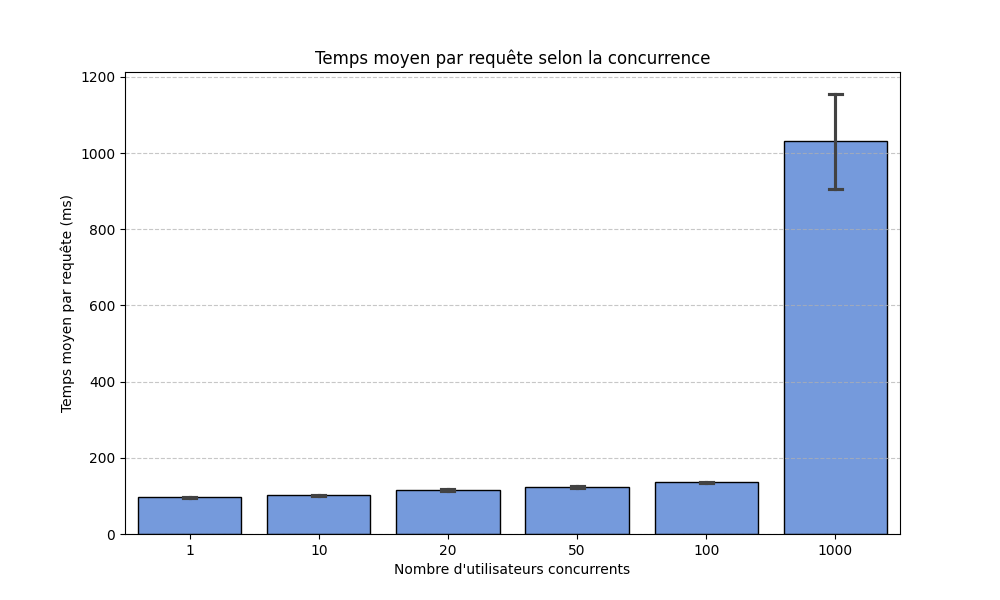
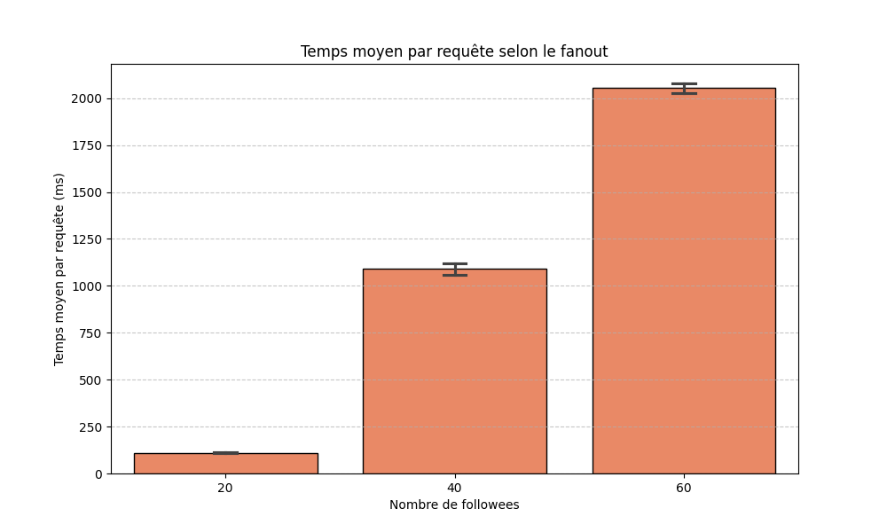

# TP Cloud - Passage à l'échelle de TinyInsta

**Nom / Prénom :** Girault-Viau Lucas

**URL de l'application déployée :** https://miage26mcsn.ew.r.appspot.com/

## 1. Expérience sur la charge (Conc)

**Protocole :** 
Taille des données fixée à 1000 utilisateurs, 50 posts par utilisateur et 20 followers par utilisateur.
Test de charge pour 1, 10, 20, 50, 100, et 1000 utilisateurs simultanés (moyenne sur 3 runs).

### Graphique des résultats

### Interprétation
Oui, les résultats obtenus sont parfaitement logiques et cela montre le comportement d'une infrastructure serverless en PaaS.

*   **De 1 à 100 utilisateurs (Scalabilité horizontale) :** On observe que le temps de réponse reste très stable (passant d'environ 96 ms à 135 ms), malgré une charge multipliée par 100. L'explication se trouve dans le nombre d'instances : App Engine a détecté l'augmentation de la charge (RPS) et a automatiquement provisionné de nouveaux serveurs (passant de 1 à 4 instances). Le système a fait du "Scale Out" pour absorber le trafic.
*   **1000 utilisateurs :** La latence moyenne augmente fortement (autour de 1000 ms). Ce phénomène s'explique par deux facteurs. Premièrement, le temps d'allumage ("cold start") de dizaines de nouvelles instances en urgence (le nombre d'instances passe brusquement de 4 à 20). Deuxièmement, la mise en file d'attente des requêtes le temps que ces nouvelles instances soient prêtes ("warm-up"). 
*   **Fiabilité :** On peut noter que le taux d'échec (colonne FAILED) est resté à 0 tout au long des tests de charge. Le routeur a préféré mettre les requêtes en attente plutôt que de rejeter les connexions.

**Conclusion sur la charge :** L'application "scale" de manière très efficace face à l'augmentation de la concurrence grâce à l'élasticité de l'environnement App Engine Standard.

## 2. Expérience sur la taille des données (Fanout)

**Protocole :**
Charge fixée à 50 utilisateurs concurrents. Nombre de posts fixé à 100 par utilisateur.
Test sur la variation du nombre de followees : 20, 40, et 60 (moyenne sur 3 runs).

### Graphique des résultats

### Interprétation
C'est un comportement logique qui montre les limites architecturales du modèle de données actuel.

Le temps d'exécution se dégrade : il passe d'environ 110 ms pour 20 followees à plus de 2000 ms pour 60 followees. L'explication technique réside dans le fonctionnement de Datastore. La requête GQL permettant de construire la timeline utilise un filtre 'IN' (`SELECT * FROM Post WHERE author IN @authors`).

Comme expliqué dans la documentation du projet, les requêtes 'IN' avec beaucoup de valeurs augmentent enormément le travail et la latence. Datastore ne fait pas une simple lecture, il effectue une union de multiples scans (un scan par auteur suivi), suivie d'une fusion (k-way merge) effectuée côté serveur pour trier les résultats par date de création.

On remarque qu'App Engine a tenté de faire face au ralentissement en maximisant son nombre d'instances (jusqu'à 20 instances actives). Cependant, cela n'a pas réduit la latence. Le goulot d'étranglement s'est déplacé de la couche applicative vers la Base de données.

## 3. Conclusion générale

La réponse doit être nuancée et séparée en deux points :

1. **Sur le plan de l'infrastructure (Serverless) : ÇA SCALE.**
   Google App Engine a bien joué son rôle de PaaS. L'auto-scaling horizontal a fonctionné en allumant de nouvelles instances à la volée pour encaisser les hausses de trafic, garantissant un taux d'échec (FAILED) de 0 % même avec 1000 utilisateurs concurrents.

2. **Sur le plan de l'architecture logicielle (Données) : ÇA SCALE PAS.**
   L'architecture de TinyInsta base la construction de la timeline sur une approche "Pull" (calcul à la lecture avec une lourde requête 'IN'). Face à l'augmentation du fanout (le nombre d'abonnements par utilisateur), les limites conceptuelles de Datastore explosent.

Pour que TinyInsta passe à l'échelle, il faudrait abandonner la requête 'IN'. Une solution serait de pré-calculer les timelines des utilisateurs. Dans l'industrie, c'est ce qu'on appelle une architecture orientée "Push" (Fanout-on-write) : lorsqu'un utilisateur publie un post, le système le copie et le pousse directement dans une "boîte de réception" pré-calculée pour chacun de ses followers. Ainsi, la lecture devient immédiate et ne demande plus aucun effort à la base de données.